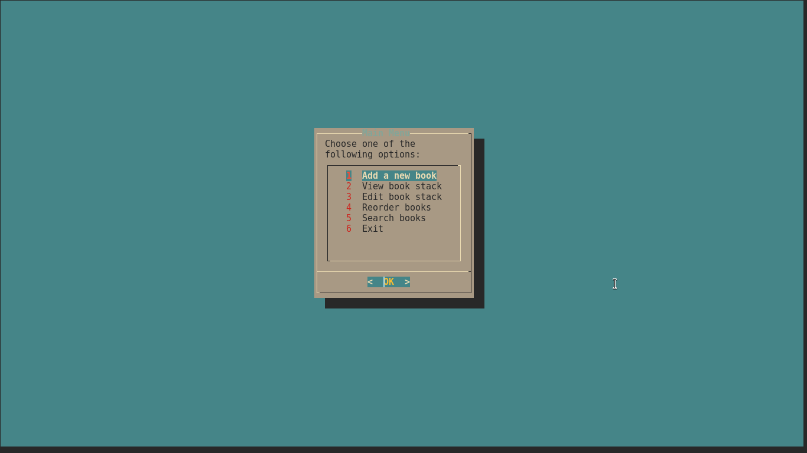
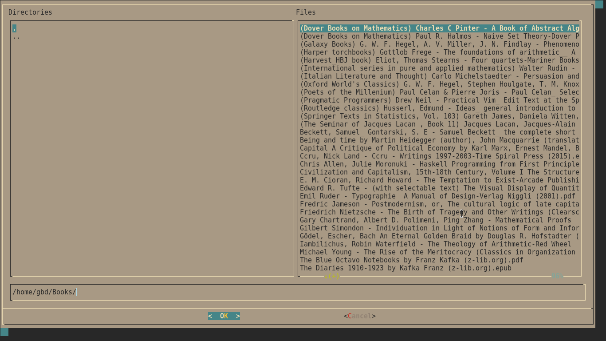
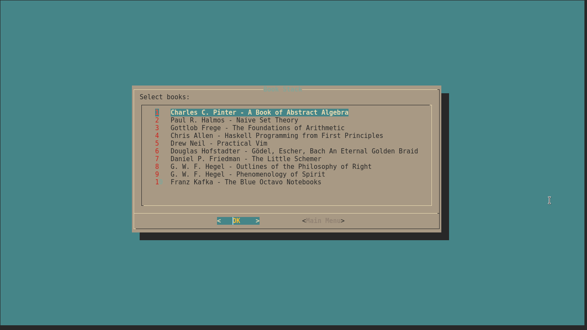

# ncstack
ncstack is a file organizing utility for books (or anything, by modifying the file opener and some dialog's texts to avoid confusion). It has stack conception in mind wherein the books are arranged vertically, but recent books are inserted below the previous books instead of otherwise (could be rearranged manually in its specified menu), to avoid consumerism, that is.

## Screenshots

## Dependencies
* dialog, sed, awk, grep
* zsh
* zathura (for reader, could be changed by editing the script)

## Setup
1. Git clone this repo
2. Empty the text files in `texts` directory
3. Edit `ncstack`'s default directory for adding books for easy navigation
4. Run the script as like any other shell script
5. Add new book first
6. Enjoy, then!
